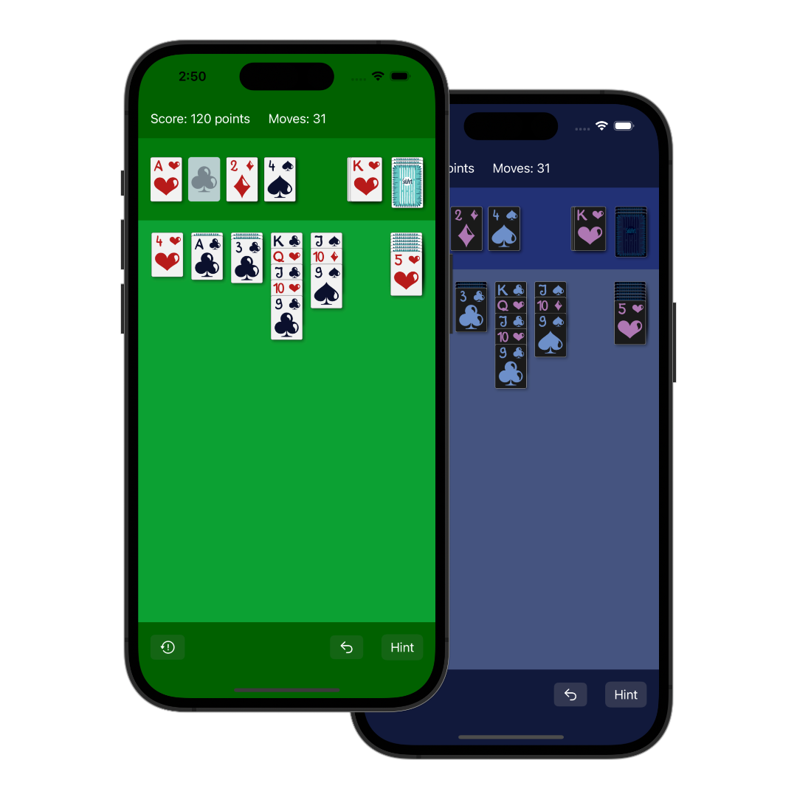

# MemoArt

**An other Solitaire/Patience/Klondike game but now developed with Swift, SwiftUI, TCA (The Composable Architecture), and with nice Art style**

📲 App Store: 🛠 WIP

## Features

* ♠️  Nice cards arts
* 💸 This application is available for iOS (iPhone and iPad) and will be for MacOS for free, and without ads.

# Screenshots

## Icons and illustrations

Artist Direction of the app, logo, and all the card designs are made by [Mathilde Seyller](https://instagram.com/myobriel). Go follow her on Instagram!

## Minimum required to build the project

Works with Xcode 13.4.1
